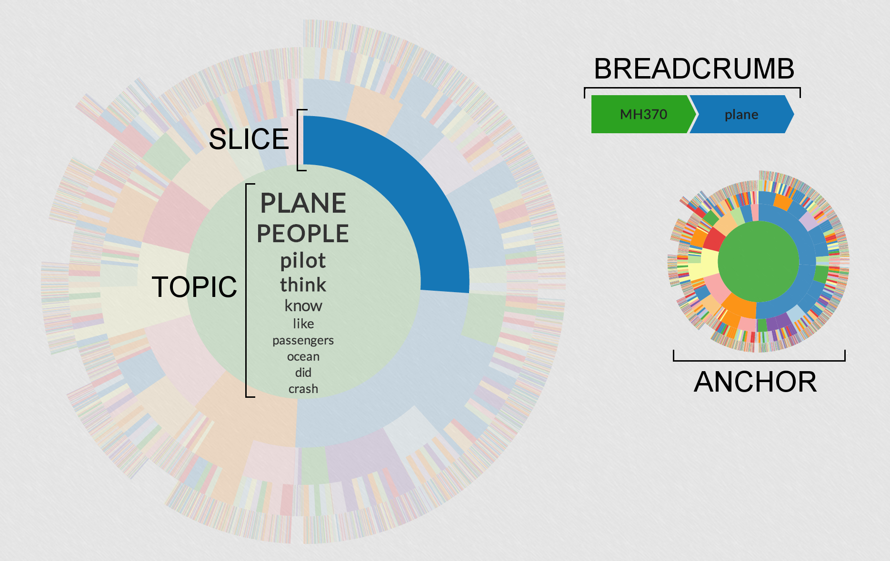

#Hierarchie

*A structured display of topics from discussion surrounding the MH-370 disappearance.*

Hierarchie provides hierarchical navigation of the different topics or themes from text. These topics are discovered using a technique called Hierarchical Latent Dirichlet Allocation (HLDA), and are represented in the visualization as lists of words.

For this example, we used a corpus of 1600 Tweets and 970 Reddit comments containing the keyword "MH370" in addition to 27 Daily Beast articles returned by a URL filter for any of the key words "malay", "370", "flight", "missing", "hijack", "radar", "pilot", "plane", "airplane", and "wreckage". These documents were collected during the first week of MH-370's disappearance. By exploring the visualization, it's possible to discern different topics and theories relating to the airliner.

Hierarchie was created by the data visualization team for [DECISIVE ANALYTICS Corporation](http://www.dac.us). This implementation of a sunburst was based upon [Sequences Sunburst](http://bl.ocks.org/kerryrodden/7090426) by Kerry Rodden and [Zoomable Sunburst](http://bl.ocks.org/mbostock/4348373) by Mike Bostock.

Further details can be found in our [workshop paper](http://nlp.stanford.edu/events/illvi2014/papers/smith-illvi2014b.pdf), and we'll be presenting our work at the [ACL 2014 Workshop on Interactive Language Learning, Visualization, and Interfaces](http://nlp.stanford.edu/events/illvi2014/index.html).

You can view the visualization live [here](http://decisive-ui.github.io/Hierarchie)!

### Interactivity

Hierarchie updates on mouseover and zooms on click, so it's best viewed on a laptop or desktop. 

### Known Issues & Suggested Improvements
- Exposing the documents underlying topics
- Search capabilities
- Improving responsiveness of website and visualizations
- Better cross-browser support (Center text appends using foreignObject will not work in IE)
- Needs tests!

### License

Hierarchie is covered by the Apache Version 2.0 License. Please see LICENSE.txt for more details.